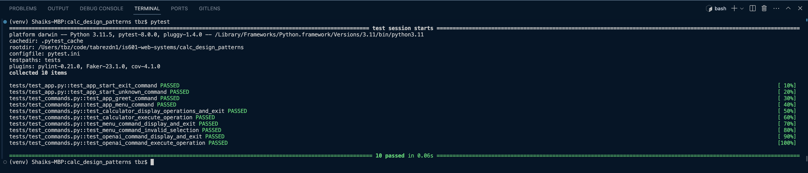
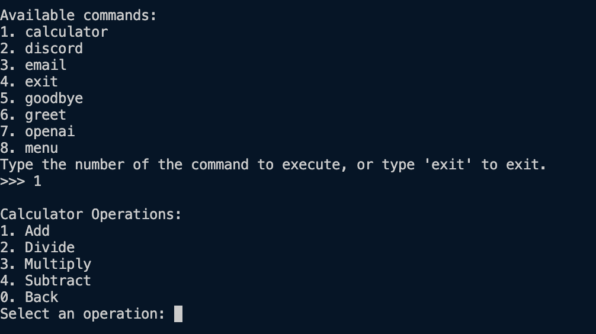

# Homework 5: Plugins

## Introduction

This project focuses on the development of an interactive command-line application that operates continuously, transitioning from a single-execution script to a fully functional application. Through this assignment, you will explore the command pattern, learn how to dynamically load commands using a simple plugin architecture, and understand the appropriate use of exceptions versus conditional statements to manage invalid data inputs. This unit lays the foundational skills for application development, preparing you for the midterm project, which requires a thorough explanation of your program's architecture, design patterns, and functionality.

## Project Enhancements from Assignment 4

Incorporate the functionalities discussed in the lecture videos to your previous assignment. This includes transforming your calculator program into an interactive application using the command pattern and REPL (Read, Evaluate, Print, Loop) principles.

## Completed tasks

- **Testing :**
  - Added test cases for three new commands: menu, calculator and openai.
  - Added test cases for dynamic plugin menu.
  - Added test cases for sub menu logic like for calculator and openai - which again has one more menu to navigate.
  

- **Functionality :**
  - Implementation of command pattern and REPL:
  
  - Interactive calculator commands (add, subtract, multiply, divide):
  
  - Interactive openai command (chat.py):
  
  - Interactive menu commands:
  
  - Successful plugin architecture integration for dynamic command loading:
  
  

## Testing Commands

- Run all tests with `pytest`.
- To test a specific file, use `pytest tests/test_main.py`.
- For linting and coverage, `pytest --pylint --cov` commands can be used separately.

